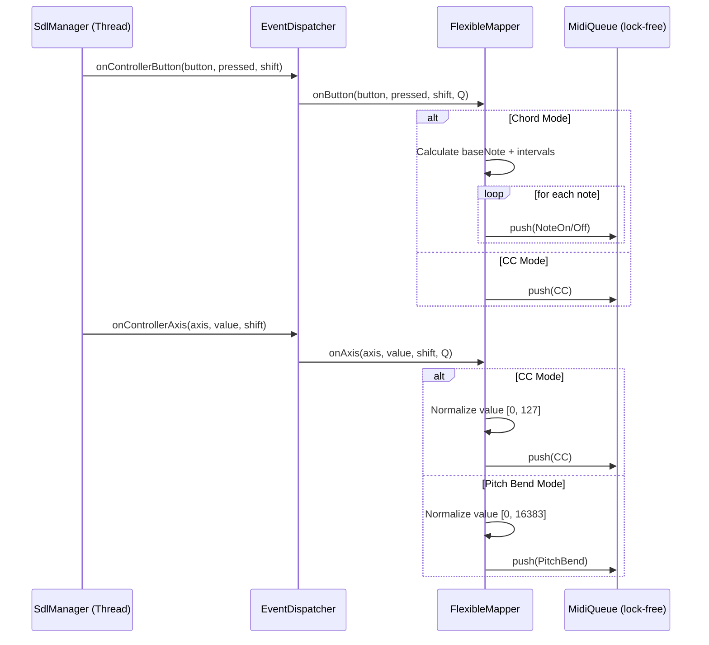

# Advanced Gamepad to MIDI Mapping Structure Proposal

This document outlines a more flexible structure for mapping gamepad events (buttons and axes) to MIDI messages, supporting chords, CC, and pitch bends.

## 1. Class Hierarchy

We will introduce a `FlexibleMapper` class that implements `IMidiMapper`. This class will store a configuration for each button and axis.

```cpp
class FlexibleMapper : public IMidiMapper {
public:
    // ...
    void setButtonConfig(uint8_t button, const ButtonConfig& config, bool shift = false);
    void setAxisConfig(uint8_t axis, const AxisConfig& config, bool shift = false);
    // ...
private:
    ButtonConfig fButtonConfigs[SDL_CONTROLLER_BUTTON_MAX][2]; // [button][shiftState]
    AxisConfig fAxisConfigs[SDL_CONTROLLER_AXIS_MAX][2];       // [axis][shiftState]
    
    // Tracking active notes for correct NoteOff (including chords)
    std::vector<uint8_t> fActiveNotes[SDL_CONTROLLER_BUTTON_MAX];
};
```

## 2. Configuration Structures

### 2.1 Button Configuration

Buttons can trigger notes, chords, CC toggles, or octave shifts.

```cpp
enum class ButtonMode {
    None,
    Note,           // Single MIDI Note
    Chord,          // Multiple MIDI Notes
    CC_Momentary,   // CC 127 on press, 0 on release
    CC_Toggle,      // CC 127 on press, 0 on next press
    OctaveUp,
    OctaveDown
};

struct ButtonConfig {
    ButtonMode mode = ButtonMode::None;
    uint8_t noteOrCC = 60; // Base note or CC number
    std::vector<int8_t> chordIntervals; // Intervals relative to base note
    uint8_t velocity = 100;
};
```

### 2.2 Axis Configuration

Axes can map to CC or Pitch Bend.

```cpp
enum class AxisMode {
    None,
    CC,
    PitchBend,
    Aftertouch
};

struct AxisConfig {
    AxisMode mode = AxisMode::None;
    uint8_t ccNumber = 0;
    bool isBipolar = true;  // true: [-32k, 32k] (sticks), false: [0, 32k] (triggers)
    bool isInverted = false;
    float deadzone = 0.1f;
};
```

## 3. Core Logic

### 3.1 Chord Logic
When `onButton` is called with `pressed=true` and `mode=Chord`:
1. Calculate all notes: `baseNote + interval` for each interval in `chordIntervals`.
2. Apply current `octaveOffset`.
3. Store these notes in `fActiveNotes[button]`.
4. Push a `NoteOn` for each note.

When `pressed=false`:
1. Push a `NoteOff` for each note in `fActiveNotes[button]`.
2. Clear `fActiveNotes[button]`.

### 3.2 Axis to CC Logic
1. Normalize the axis value to `[0.0, 1.0]`.
   - If bipolar: `(value + 32768) / 65535.0`
   - If unipolar: `value / 32767.0` (with clamping)
2. Scale to `[0, 127]`.
3. Push `CC` message.

### 3.3 Axis to Pitch Bend Logic
1. Normalize axis value to `[0, 16383]` (14-bit).
   - If bipolar: Map `[-32768, 32767]` to `[0, 16383]`.
2. Push `PitchBend` message.

## 4. Implementation Steps

1. **Refactor `IMidiMapper`**: Add support for initialization or loading configurations (optional, can be done via subclass).
2. **Create `FlexibleMapper`**: Implement the `onButton` and `onAxis` logic as described.
3. **Update `EventDispatcher`**: Allow switching between `MajorScaleMapper` and `FlexibleMapper`.
4. **Update UI (Future)**: Add a configuration screen to set these mappings.

## 5. Sequence Diagram


